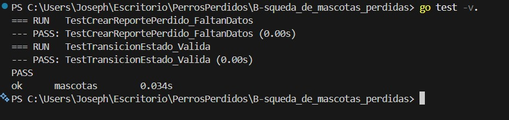
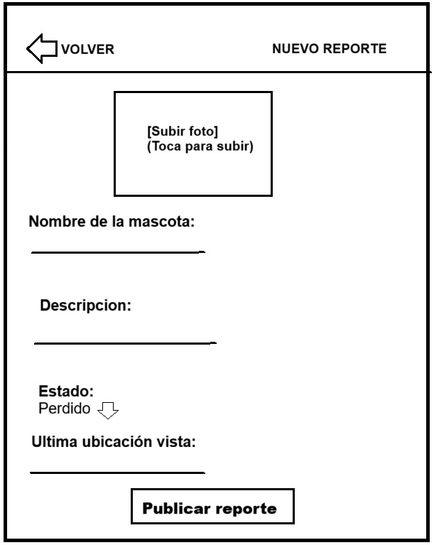
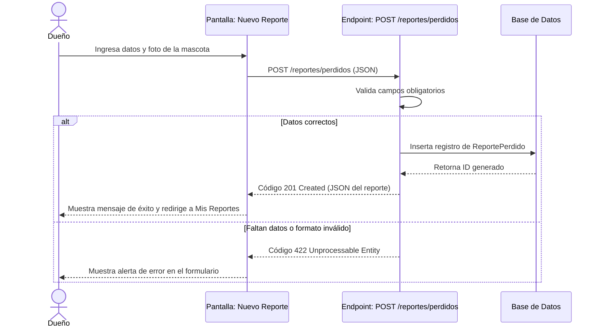
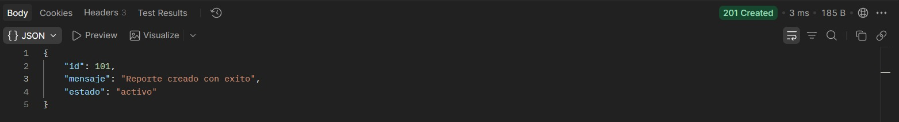
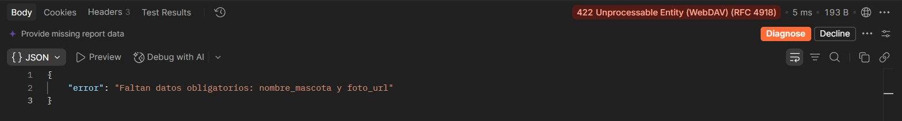

# Hito 1 · Addendum técnico

**Pareja:**jandry Paúl Sánchez Murillo · Joseph Damian Loor Chila
**Paralelo:** Aplicación para el Servidor Web A

## A. Estructura del proyecto

<!-- El árbol de carpetas, con una línea por cada una diciendo qué guarda. -->

```
.
├── main.go                     # Punto de entrada de la aplicación HTTP en Go
├── go.mod                      # Módulo Go y declaración de dependencias
├── go.sum                      # Checksums y hashes de verificación de dependencias
├── internal/
│   └── petfind/
│       ├── modelos.go          # Structs de GORM con etiquetas de validación y JSON
│       ├── manejadores.go      # Controladores HTTP (Handlers de endpoints)
│       └── rutas.go            # Declaración de rutas y middleware de autenticación
└── docs/                       # Documentación requerida del Hito 1
    ├── hito1_ficha_del_negocio.md
    ├── hito1_addendum.md
    └── hito1_presentacion.pdf

```

## B. Configuración y secretos

DB_DSN

Cadena de conexión DSN a la base de datos MySQL/PostgreSQL

usuario:clave@tcp(127.0.0.1:3306)/petfind_db?parseTime=true

| Variable | Para qué sirve                                           | Ejemplo (sin datos reales) |
|----------|----------------                                          |----------------------------|
|PORT      |Puerto TCP donde escucha el servidor web                  |                            |
|DB_DSN    |Cadena de conexión DSN a la base de datos MySQL/PostgreSQL|usuario:clave@tcp(127.0.0.1:3306)/petfind_db?parseTime=true|


## C. Pruebas


| Prueba | Qué caso cubre |
|--------|----------------|
|        |                |
|        |                |

**Captura de `go test ./...`:** 

## D. Boceto de la pantalla principal

<!-- La pantalla que consume el endpoint de listado. A mano y fotografiada, o en cualquier herramienta.
     Tiene que verse qué campos muestra y dónde aparece el estado. -->



## E. Diagrama de secuencia del caso de uso principal




## F. Capturas de respuestas

<!-- Dos capturas: una petición que sale bien y una que falla la validación. Que se vea el código. -->

**Caso correcto:** 

**Caso con error de validación:** 